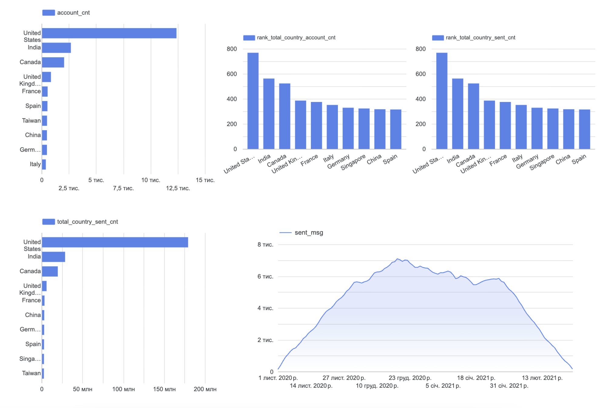

# Email Marketing Country Analysis

## Overview

This project focuses on analyzing email marketing performance across different countries.

The SQL query combines data from accounts, sessions, and email activity to calculate key email marketing metrics and identify countries with the highest overall number of accounts and sent messages.

## Analysis

The SQL query performs the following steps:

* Combines account and email activity data using `UNION ALL`
* Aggregates account, sent message, open message, and visit message counts
* Calculates total account and sent message counts by country using window functions
* Ranks countries based on their total account and email activity
* Identifies countries that rank among the top 10 by either total accounts or sent messages

## Technologies

* SQL
* Google BigQuery

## Visualization

The query results were further used to create visualizations for presenting the key findings.

### Visualization

